# VSD-RISC-V_based_MYTH

This repository provides all the information required to build RISC-V pipelined core that supports base integer RV32I instruction format using TL-Verilog on makerchip platform. First we develop a simple calculator and used the similar logic to built our RISC-V core.

# Table of Contents

- [Day 1 Introduction to RISC-V ISA and GNU compiler toolchain](#day-1-introduction-to-risc---v-isa-and-gnu-compiler-toolchain)
  * [RISC-V basics](#rics---v-basics)
  * [Integer number representation](#integer-number-representation)
  * [Signed and unsigned arithmetic operation](#signed-and-unsigned-arithmetic-operation)
- [Day 2 Introductoion to ABI and basic verification flow](#day-2-introduction-to-abi-and-basic-verification-flow)
  * [Application Binary Interface](#application-binary-interface)
  * [ABI function call](#abi-function-call)
  * [Verification flow using iverilog](#verifivation-flow-using-iverilog)
- [Day 3 Digital Logic with TL-verilog and Makerchip](#day-3-digital-logic-with-tl-verilog-and-makerchip)
  * [Combinational logic](#combinational-logic)
  * [Sequential and pipelined logic](#sequential-logic)
  * [Validity and Hierarchy](#validity-and-hierarchy)
- [Day 4 Basic RISC-V CPU micro-architecture](#day-4-basic-risc---v-cpu-micro-architecture)
  * [Fetch](#fetch)
  * [Decode](#decode)
  * [Read and Write](#read-and-write)
  * [Execute](#execute)
  * [RISC-V control logic](#risc---v-control-logic)
- [Day 5 Complete Pipelined RISC-V CPU micro-architecture/store](#day-5-complete-pipelined-risc---v-cpu-micor---architecture/store)
  * [Pipelining the CPU](#pipelining-the-cpu)
  * [Load and store instructions and memory](#load-and-store-instructions-and-memory)
  * [Completing the RISC-V CPU](#completing-the-risc---v-cpu)
- [Acknowledgement](#acknowledgement)

# Day 1 Introduction to RISC-V ISA and GNU compiler toolchain

RISC(Reduced Instruction Set Computer) computers are designed with simpler ISA for faster computation and less complexity. A RISC-V ISA is defined as a base integer ISA that is characterized by
  * Width of the integer register(XLEN)
  * Corresponding size of the address space
  * Number of integer registers (32 in RISC-V)

In Linux, GNU Toolchain can be used to make and compile code to produce a proge=ram or library. CPU consists of very large number of transistors and can only understand binary numbers, 1's and 0's. The combination of 1's and 0's are fed to the CPU and based on the input it performs certain task. These inputs are called Machine language code. The high level program writted by programmers are compiled by the compiler to produce executable code. Assembler converts these executable code to relocatable machine code and finally Linker converts it into Absolute machine code.

  * To use the RISC-V gcc compiler, we use the following command:
  
`riscv64-unknown-elf-gcc -Ofast -mabi=lp64 -march=rv64i -o <object filename> <C filename>`

`riscv64-unknown-elf-gcc <compiler option -O1 ; Ofast> <ABI specifier -lp64; -lp32; -ilp32> <architecture specifier -RV64 ; RV32> -o <object filename> <C filename>`

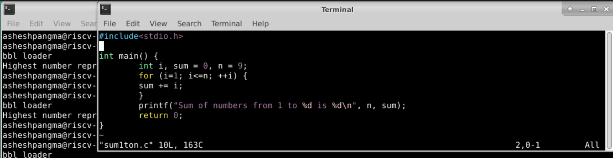

  * To run this C program we use the following command:
  ```
  gcc sum1ton.c
  ./a.out
  ``` 
The below figure shows the output.
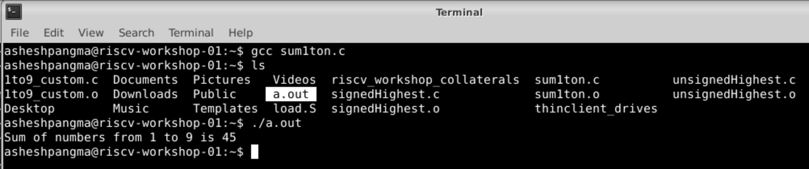

To view assembly code, we use the following command:

`riscv64-unknown-elf-objdump -d <object filename>`

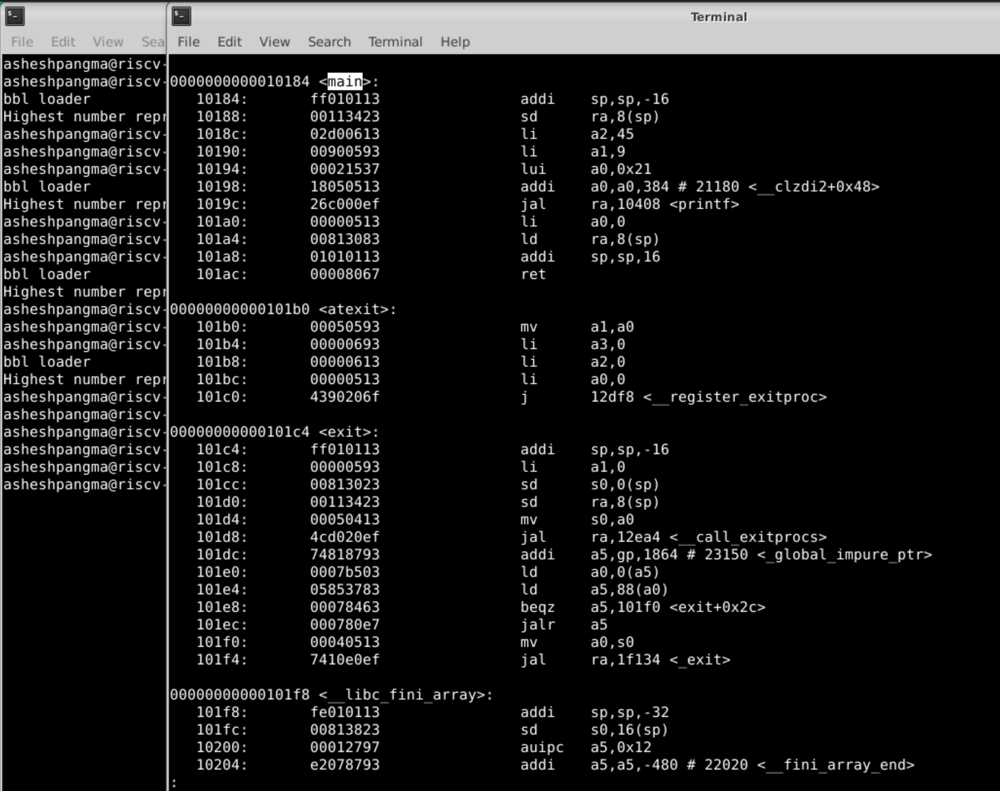

We can also use Spike simulator to run risc-v object file using the following command:

`spike pk <object filename>`

Spike debugger can be used using the following command:

`spike -d pk <object Filename>`

The code below is used to run our program till the given PC(Program Counter).

`until pc 0 <pc of your choice>`

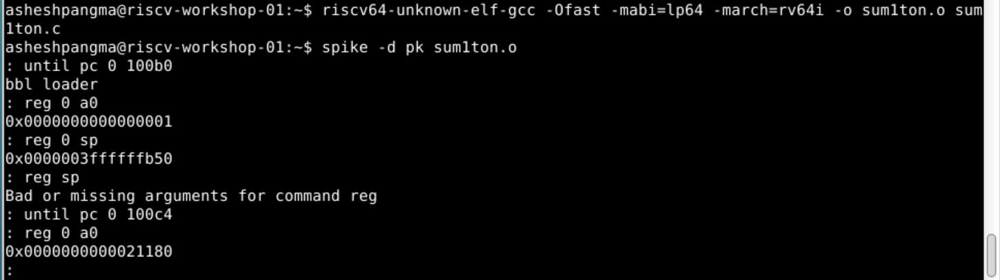

## Signed and unsigned arithmetic operation

The following C code is used to print the highest unsigned integer that can be represented in risc-v.

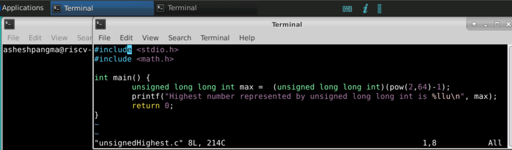

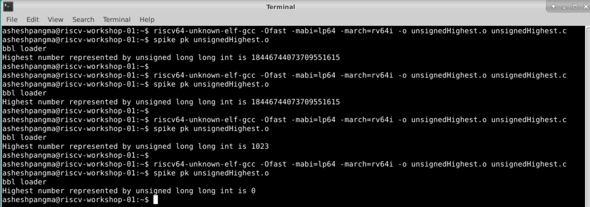

The following C code is used to print the highest and lowest signed integer that can be represented in risc-v.


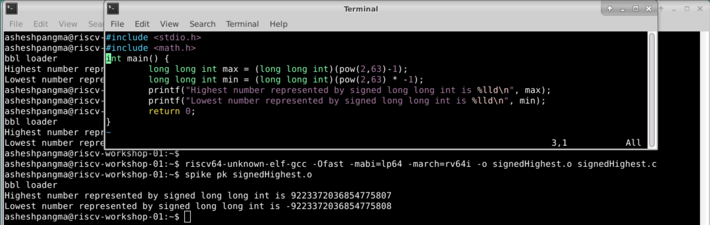


Follow the below link to install complete risc-v toolchain locally on linux machine.

  * [RISC-V GNU Toolchain](http://hdlexpress.com/RisKy1/How2/toolchain/toolchain.html)
  * [RISC-V ISA Simulator - Spike](https://github.com/kunalg123/riscv_workshop_collaterals)


# Day 2 Introductoion to ABI and basic verification flow

An ABI(Application Binary Interface) is used for translating relocatable machine code to absolute machine code specific to the architecture of machine. This means, ABI interface are used by application program to access the register specific to the architecture. In out case, it is RISC-V and there are 32 registers that can be used by applicatio programmer.
First we clone the repository as shown in the figure below:

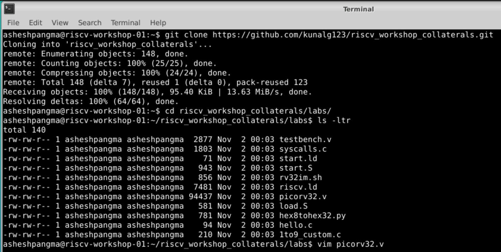

The picture below shows us the C program and the load function that the C program calls.

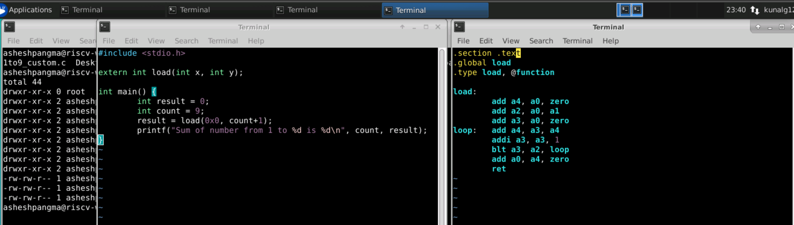

We run the C program using RISC-V gcc compiler as shown by the picture below below:

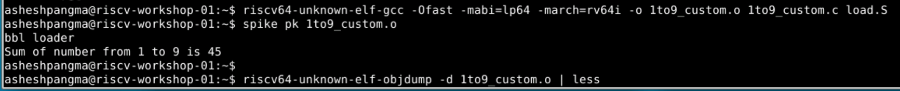

The assembly code for the above run is shown below:

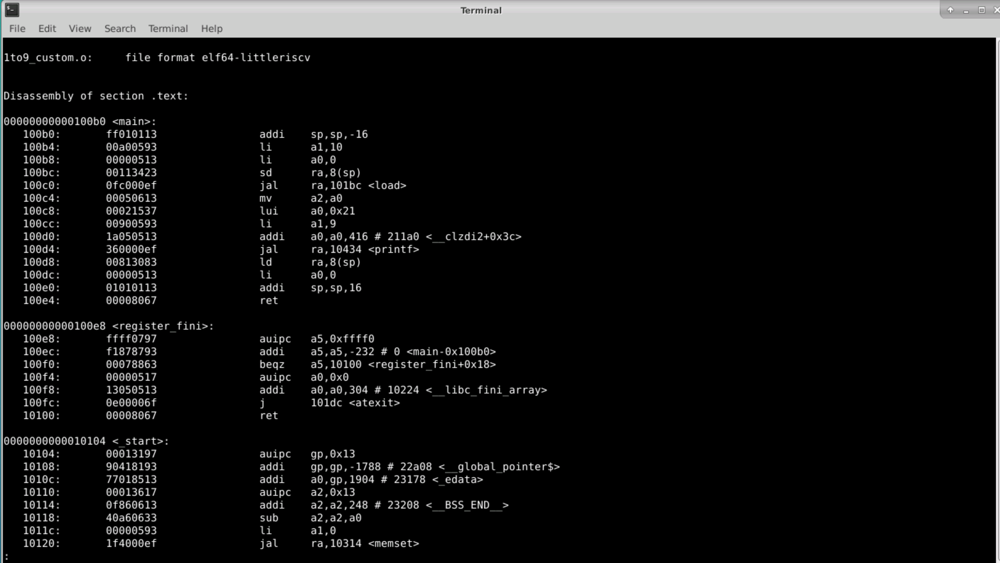

The following picture shows the script that is used to create hex file and load the files in picorv32 memory and run it. Iverilog takes testbench.v and picorv32.v as inputs and gives testbench.vvp as output.

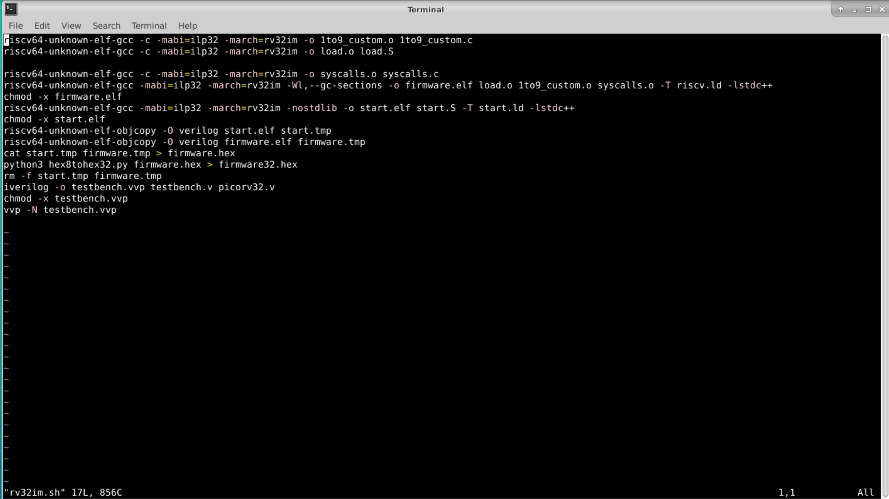

The verilog code for testbench.v is shown by the picture below. Here, we see picorv32 is the uut(unit under test) and the hex file being loaded in the testbench.

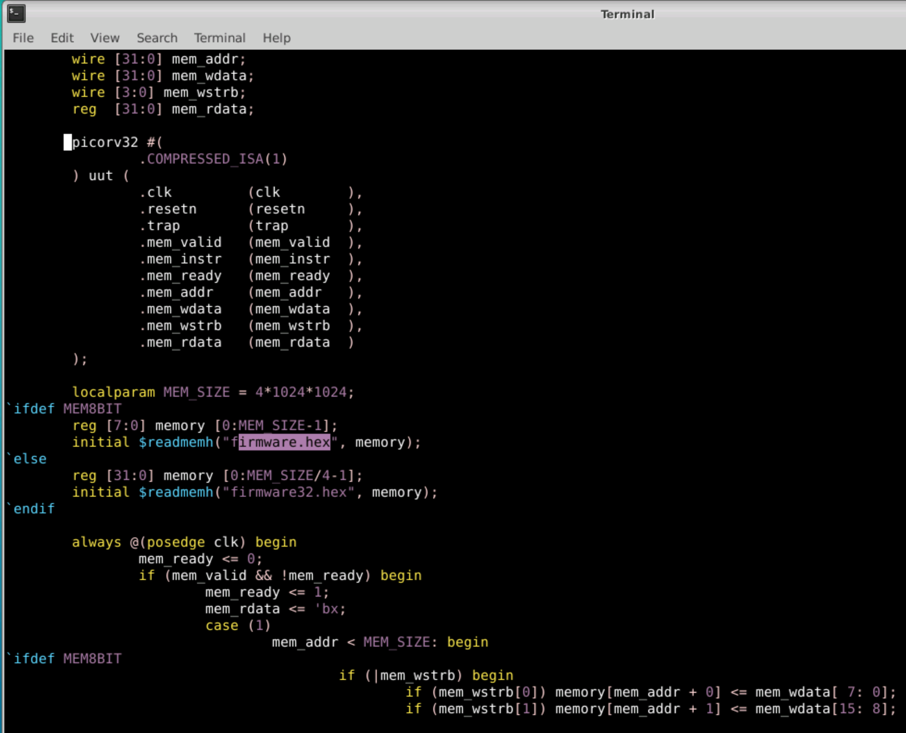

First we make the script executable and then run the script. The output is obtained as shown below:

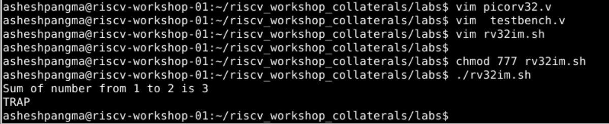


# Day 3 Digital Logic with TL-verilog and Makerchip

We used [makerchip](https://makerchip.com/) to develop our RISC-V core using TL-verilog. Makerchip is free and online environment for developing high quality integrated circuits. It provides various features for programmers to code, compile, simulate and debug the design. 

## Combinational logic

Our first design is an inverter which is a combinational circuit. The following code is used for designing an inverter in makerchip IDE:
```
$out = ! $in;
```
We even do not need to declare the input `$in` and `$out` signals. No assignment is required for `$in` signal. The IDE automatically provides random stimulus and produce a warning. The below snapshot shows a combinational calculator.
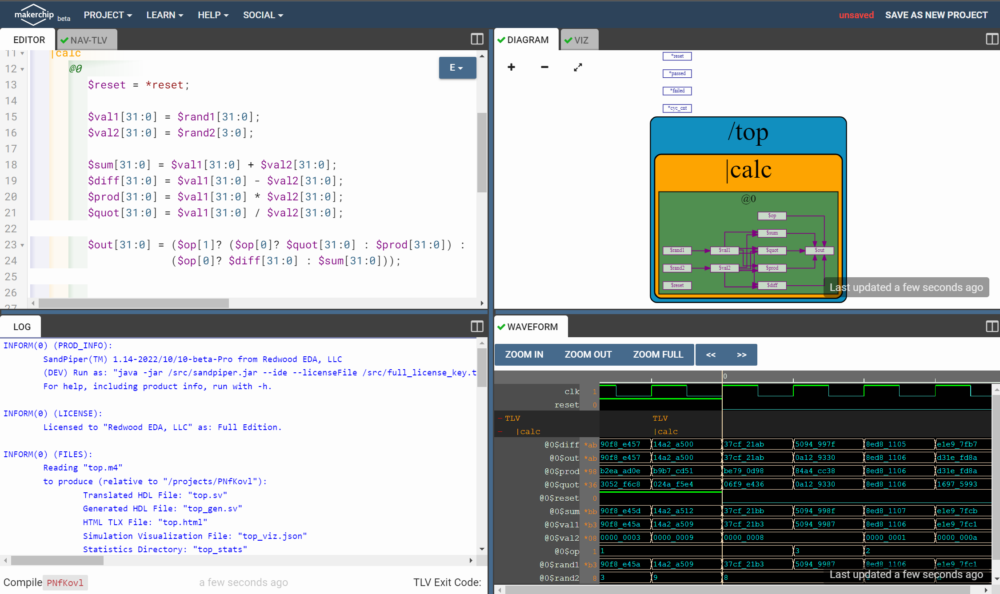

## Sequential logic

For sequential logic, we take an example of Fibonacci series with a reset signal. 
```
$num[31:0] = $reset ? 1 : (>>1$num + >>2$num)
```
The `>>1`  and `>>2` operator denotes that the value of the signal provided is 1 cycle before and 2 cycle before respectively.
Below snapshot shows a sequential calculator.

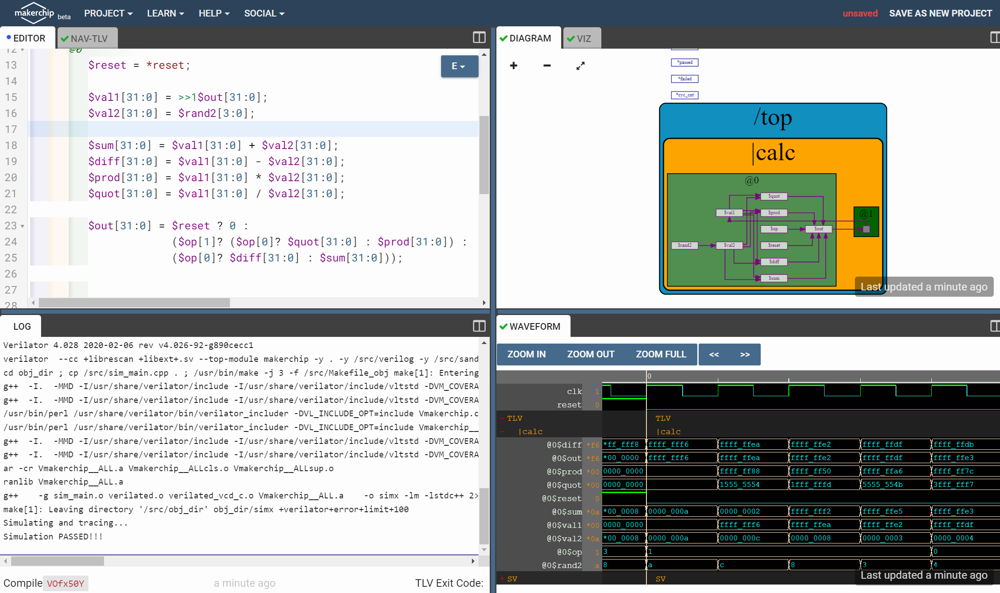

## Pipelined logic

A powerful feature of TL-verilog is Timing abstract. It help to convert a code into pipeline stages thus increasing the frequency of operation. `|pipe` defines the pipeline and `@?` defines the stages in a pipeline.
The snapshot below shows calculator with pipelined logic.

## Validity

The validity is denoted by using `?$valid`. This indicates the validity of the transaction and other times it indicates the transaction as don't care. The snapshot below shows 2-cycle calculator with validity.


The snapshot below shows our the design of our calculator.

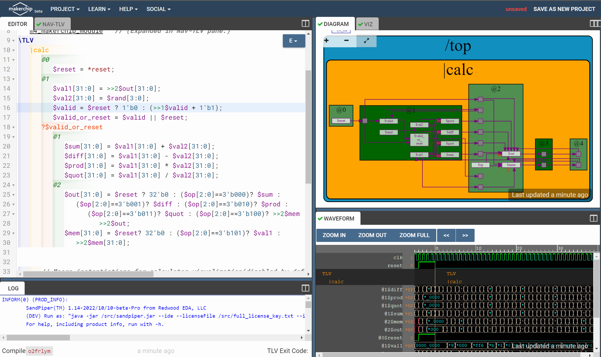


# Day 4 Basic RISC-V CPU micro-architecture

We focused in designing the basis of processor. The fetch, decode and execute stages for RISC-V ISA were programmed in our fourth day of the workshop. At the end, we also added a control logic for branch instruction.

## Fetch

PC(Program Counter) holds the address of next instruction to be executed and IM(Instruction Memory) holds the set of instructions to be executed. At this stage, the processor fetch the instruction from the Instruction Memory pointed by address given by PC. The below snapshot shows the Fetch stage of our design that is done in Makerchip IDE.
The snapshot below shows the the Fetch stage.

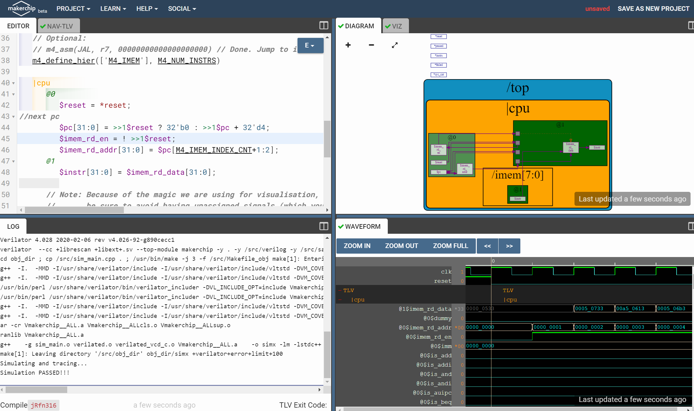

## Decode

We decode the fetched instruction in this stage. RISC-V ISA has 6 types of instruction that are as follows:
  * R-type - Register
  * I-type - Immediate
  * S-type - Store
  * B-type - Branch (Conditional Jump)
  * U-type - Upper Immediate
  * J-type - Jump (Unconditional Jump)
$imem_rd_data[6:2] determines the type of instruction that is being fetched.  $funct7, $funct3 and $opcode determines the type of instruction that is being decoded.
The snapshot below shows the Decode stage.

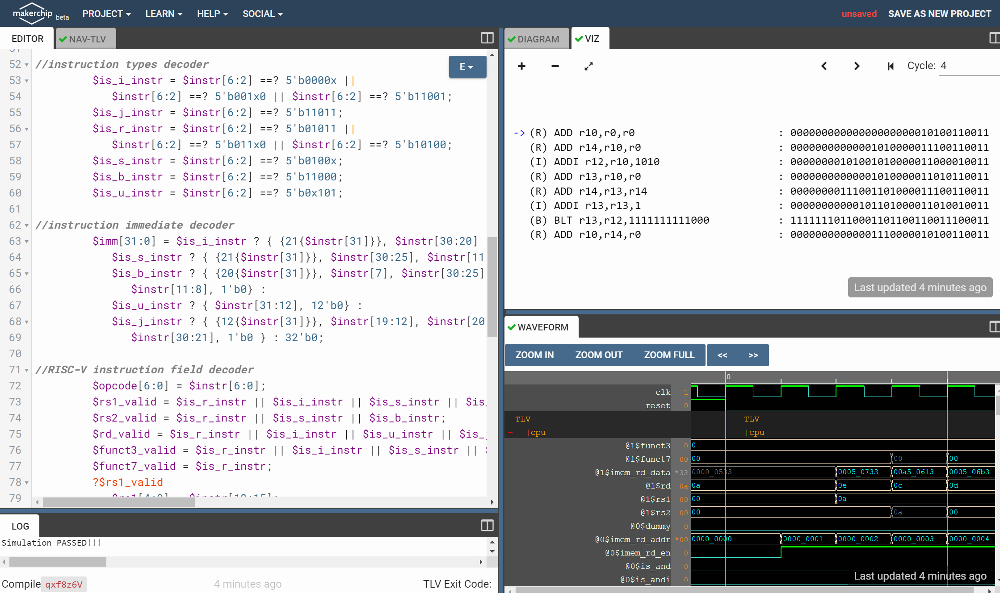

## Read and Write Register File

The register file provided is a 2 read, 1 write register. This means that it supports 2 read and 1 write operation simultaneously. There are 8 input signals and two output signal for the register file.
Inputs:
  * $reset              - reset signal
  * $rf_wr_en           - Enable signal to perform write operation
  * $rf_wr_index[4:0]   - Address where data has to be written
  * $rf_wr_data[31:0]   - Data to be written at write address
  * $rf_rd_en1          - Enable signal to perform read operation
  * $rf_rd_index1[4:0]  - Address1 from where data has to be read
  * $rf_rd_en2          - Enable signal to perform read operation from Address2
  * $rf_rd_index2[4:0]  - Address2 from where data has to be read
Outputs:
  * $rf_rd_data1        - Data read from Address1
  * $rf_rd_data2        - Data read from Address2

The snapshot below shows the Register File Read followed by Register File Write operation.

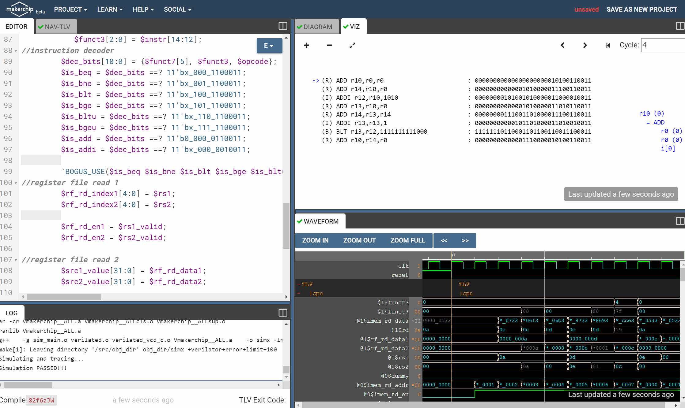

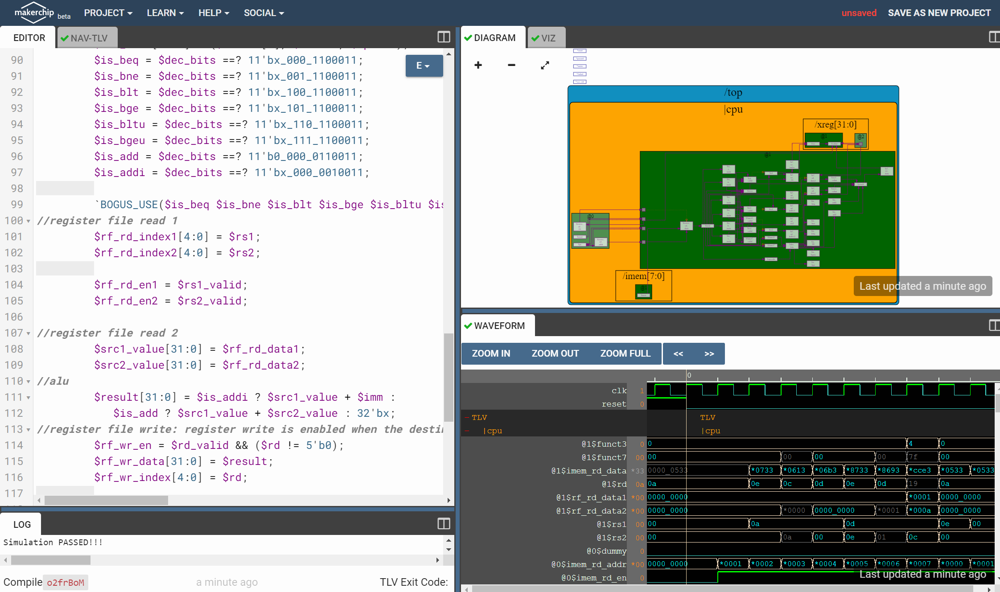

## Execute

The decoded instruction is then executed on the operands from the register file. The $result signal holds the output of the ALU.
The snapshot below shows Execute stage.

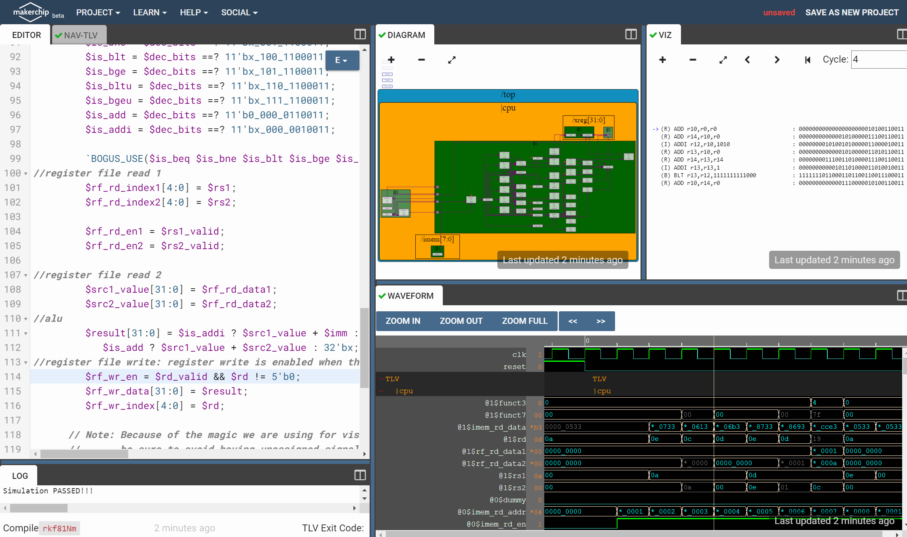

## RISC-V Control Logic

The branch target address is calculated during decode stage and fed to into the PC mux. Branch condition is checked to determine the instruction to be executed. The PC is loaded with branch target address if the branch condition is true.
The snapshot shows the control logic for branch instruction.

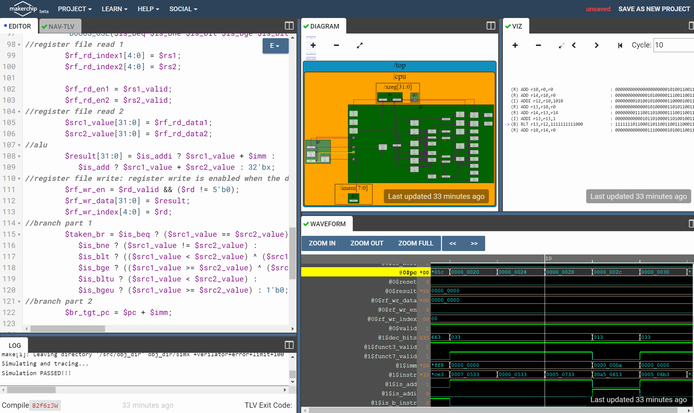


# Day 5 Complete Pipelined RISC-V CPU micro-architecture/store

## Pipelining the CPU

## Load and Store instructions and memory

## Completing the RISC-V CPU

## [Acknowledgement](#acknowledgement)
  * Kunal Ghosh, Co-founder, VSD Corp. Pvt. Ltd.
  * Steve Hoover, Founder, Redwood EDA
  * Shivam Potdar, GSoC 2020 @fossi-foundation
  * Shivani Shah, TA
